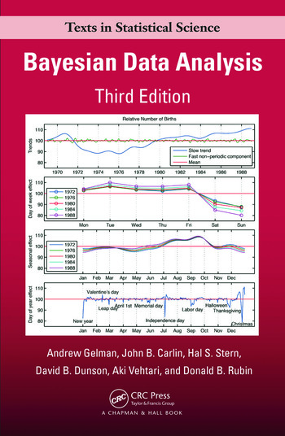
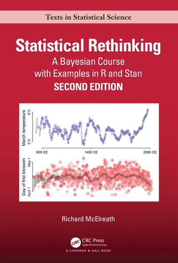
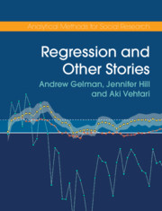
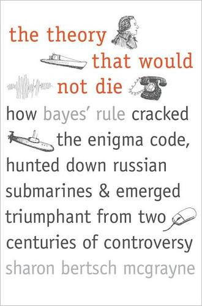

Workshop of Bayesian Statistics with Julia and Turing
================

[](http://creativecommons.org/licenses/by-sa/4.0/)

<div class="figure" style="text-align: center">


<p class="caption">
Bayesian for Everyone!
</p>

</div>

This is a [**Turing**](http://turing.ml/) Workshop on how to do **Bayesian Statistics**. The Workshop is heavily based on tutorials available at [storopoli.io/Bayesian-Julia](https://storopoli.io/Bayesian-Julia). If you want you can see the [YouTube video](https://youtu.be/CKSxxJ7RdAU) from the recorded workshop at [Stuttgart Julia Programming Language Meetup Group](https://www.meetup.com/stuttgart-julia-programming-language-meetup-gruppe/).

**Bayesian statistics** is an approach to inferential statistics based on Bayes' theorem, where available knowledge about parameters in a statistical model is updated with the information in observed data. The background knowledge is expressed as a prior distribution and combined with observational data in the form of a likelihood function to determine the posterior distribution. The posterior can also be used for making predictions about future events.

**Bayesian statistics** is a departure from classical inferential statistics that prohibits probability statements about parameters and is based on asymptotically sampling infinite samples from a theoretical population and finding parameter values that maximize the likelihood function. Mostly notorious is null-hypothesis significance testing (NHST) based on *p*-values. Bayesian statistics **incorporate uncertainty** (and prior knowledge) by allowing probability statements about parameters, and the process of parameter value inference is a direct result of the **Bayes' theorem**.

$$\underbrace{P(\theta \mid y)}_{\text{Posterior}} = \frac{\overbrace{P(y \mid  \theta)}^{\text{Likelihood}} \cdot \overbrace{P(\theta)}^{\text{Prior}}}{\underbrace{P(y)}_{\text{Normalizing Costant}}}$$

## Table of Contents

   * [Julia](#julia)
   * [Turing](#turing)
   * [Author](#author)
   * [How to use the content?](#how-to-use-the-content)
   * [What about other Turing tutorials?](#what-about-other-turing-tutorials)
   * [How to cite](#how-to-cite)
   * [Books](#recommended-books)
   * [License](#license)

## Julia

[**Julia**](https://www.julialang.org) is a fast dynamic-typed language that just-in-time (JIT) compiles into native code using LLVM. It ["runs like C but reads like Python"](https://www.nature.com/articles/d41586-019-02310-3), meaning that is *blazing* fast, easy to prototype and read/write code. It is multi-paradigm, combining features of imperative, functional, and object-oriented programming. I won't cover Julia basics and any sort of data manipulation using Julia in the tutorials, instead please take a look into the following resources which cover most of the introduction to Julia and how to work with tabular data in Julia:

* [**Julia Documentation**](https://docs.julialang.org/): Julia documentation is a very friendly and well-written resource that explains the basic design and functionality of the language.
* [**Thinking Julia**](https://benlauwens.github.io/ThinkJulia.jl/latest/book.html): introductory beginner-friendly book that explains the main concepts and functionality behind the Julia language.
* [**Julia High Performance**](https://www.amazon.com/Julia-High-Performance-Avik-Sengupta/dp/178829811X): book by two of the creators of the Julia Language ([Avik Sengupta](https://www.linkedin.com/in/aviks) and [Alan Edelman](http://www-math.mit.edu/~edelman/)), it covers how to make Julia even faster with some principles and tricks of the trade.
* [**An Introduction DataFrames**](https://github.com/bkamins/Julia-DataFrames-Tutorial): the package [`DataFrames.jl`](https://dataframes.juliadata.org/stable/) provides a set of tools for working with tabular data in Julia. Its design and functionality are similar to those of `pandas` (in Python) and `data.frame`, `data.table` and `dplyr` (in R), making it a great general purpose data science tool, especially for those coming to Julia from R or Python.This is a collection of notebooks that introduces `DataFrames.jl` made by one of its core contributors [Bogumił Kamiński](https://github.com/bkamins).

## Turing

[**Turing**](http://turing.ml/) is a ecosystem of Julia packages for Bayesian Inference using [probabilistic programming](https://en.wikipedia.org/wiki/Probabilistic_programming). Models specified using Turing are easy to read and write — models work the way you write them. Like everything in Julia, Turing is [fast](https://arxiv.org/abs/2002.02702).

## Author

José Eduardo Storopoli, PhD - [*Lattes* CV](http://lattes.cnpq.br/2281909649311607) - [ORCID](https://orcid.org/0000-0002-0559-5176) - <https://storopoli.io>

<josees@uni9.pro.br>

I would like to thank [Stuttgart Julia Programming Language Meetup Group](https://www.meetup.com/stuttgart-julia-programming-language-meetup-gruppe/) and [Juliane Weilbach](https://www.linkedin.com/in/juliane-weilbach-47946117a/) for the opportunity to present the first version of this Workshop.

## How to use the content?

The content is licensed under a very permissive Creative Commons license (CC BY-SA). You are mostly welcome to contribute with [issues](https://www.github.com/storopoli/Turing-Workshop/issues) and [pull requests](https://github.com/storopoli/Turing-Workshop/pulls). My hope is to have **more people into Bayesian statistics**. The content is aimed towards social scientists and PhD candidates in social sciences. I chose to provide an **intuitive approach** rather than focusing on rigorous mathematical formulations. I've made it to be how I would have liked to be introduced to Bayesian statistics.

Just access [storopoli.io/Turing-Workshop](https://storopoli.io/Turing-Workshop) and click on `Edit or run this notebook` and then click on `binder`!

To configure a local environment:

1. Download and install [Julia](https://www.julialang.org/downloads/)
2.  Clone the repository from GitHub:
    `git clone https://github.com/storopoli/Turing-Workshop.git`
3.  Access the directory: `cd Turing-Workshop`
4.  Run the Pluto Notebook by typing in the Julia REPL:
    ```julia
    using Pluto
    Pluto.run(notebook="Turing_Workshop.jl")
    ```

## What about other Turing tutorials?

Despite not being the only Turing tutorial that exists, this workshop aims to introduce Bayesian inference along with how to use Julia and Turing. Here is a (not complete) list of other Turing tutorials:

1. [**Official Turing Tutorials**](https://turing.ml/dev/tutorials/): tutorials on how to implement common models in Turing
2. [**Statistical Rethinking - Turing Models**](https://statisticalrethinkingjulia.github.io/TuringModels.jl/): Julia versions of the Bayesian models described in *Statistical Rethinking* Edition 1 (McElreath, 2016) and Edition 2 (McElreath, 2020)
3. [**Håkan Kjellerstrand Turing Tutorials**](http://hakank.org/julia/turing/): a collection of Julia Turing models

## How to cite

To cite these tutorials, please use:

    Storopoli (2021). Workshop of Bayesian Statistics with Julia and Turing. https://storopoli.io/Turing-Workshop.

Or in BibTeX format (LaTeX):

    @misc{storopoli2021turingworkshop,
      author = {Storopoli, Jose},
      title = {Workshop of Bayesian Statistics with Julia Turing},
      url = {https://storopoli.io/Turing-Workshop},
      year = {2021}
    }

## Recommended Books

* [Gelman, A., Carlin, J. B., Stern, H. S., Dunson, D. B., Vehtari, A., & Rubin, D. B. (2013). *Bayesian Data Analysis*. Chapman and Hall/CRC.](https://www.routledge.com/Bayesian-Data-Analysis/Gelman-Carlin-Stern-Dunson-Vehtari-Rubin/p/book/9781439840955)
<div class="figure" style="text-align: center">

</div>

* [McElreath, R. (2020). *Statistical rethinking: A Bayesian course with examples in R and Stan*. CRC press.](https://www.routledge.com/Statistical-Rethinking-A-Bayesian-Course-with-Examples-in-R-and-STAN/McElreath/p/book/9780367139919)
<div class="figure" style="text-align: center">

</div>

* [Gelman, A., Hill, J., & Vehtari, A. (2020). *Regression and other stories*. Cambridge University Press.](https://www.cambridge.org/fi/academic/subjects/statistics-probability/statistical-theory-and-methods/regression-and-other-stories)
<div class="figure" style="text-align: center">

</div>

* [McGrayne, S.B (2012). *The Theory That Would Not Die: How Bayes' Rule Cracked the Enigma Code, Hunted Down Russian Submarines, and Emerged Triumphant from Two Centuries of Controversy* Yale University Press.](https://www.amazon.com/Theory-That-Would-Not-Die/dp/0300188226/)
<div class="figure" style="text-align: center">

</div>


## License

This content is licensed under [Creative Commons Attribution-ShareAlike 4.0 Internacional](http://creativecommons.org/licenses/by-sa/4.0/).

[](http://creativecommons.org/licenses/by-sa/4.0/)
